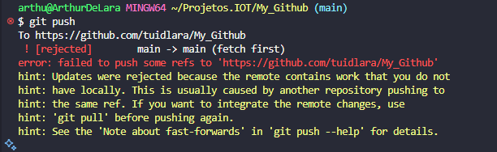
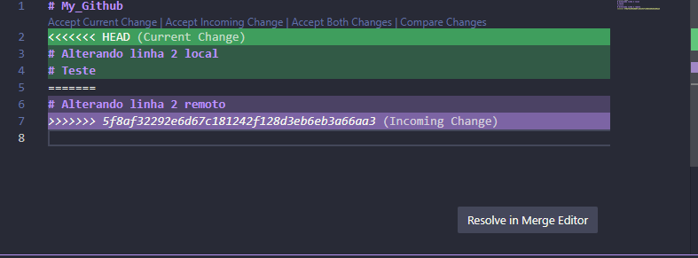

Primeiramente eu adicionei um texto na linha 2 do remoto, e outro texto na linha 2 do local, tentei dar commit porém deu esta mensagem de erro:

Para resolver este conflito tive que mesclar as alterações

E após isso, 